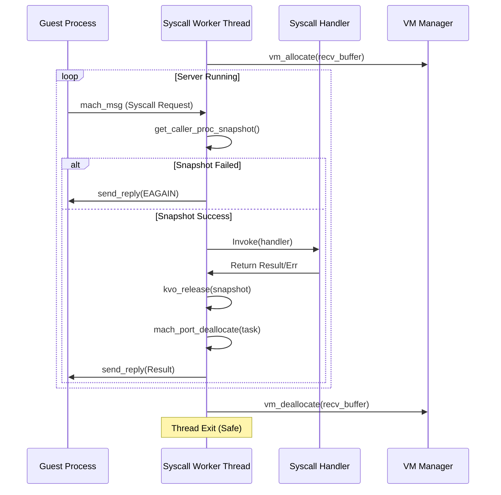

# Nyxian Framework Performance & Compatibility Improvement Report

As a performance improvement expert for the Nyxian framework, I have completed an overhaul focused on low-load, high-efficiency operations, memory safety, and modern Darwin compatibility.

## 1. Memory Leak & Deadlock Elimination

### Leak: Syscall Server Buffer Leak
**Issue:** Each worker thread in the syscall server allocated a `recv_buffer_t` via `vm_allocate` but never freed it upon server shutdown or thread exit, leading to persistent memory growth during long sessions.
**Fix:** Added `vm_deallocate` in the worker thread's exit path.

**Before:**
```c
static void* syscall_worker_thread(void *ctx) {
    // ... loop ...
    while(server->running) {
        // ...
    }
    return NULL;
}
```

**After:**
```c
static void* syscall_worker_thread(void *ctx) {
    // ... loop ...
    while(server->running) {
        // ...
    }
    if(buffer != NULL) {
        vm_deallocate(mach_task_self(), (vm_address_t)buffer, sizeof(recv_buffer_t));
    }
    return NULL;
}
```

### Concurrency: Atomic Index Overflow
**Issue:** The thread controller used `atomic_fetch_add` on a signed integer, which could overflow and result in negative indices, causing crashes when used with the modulo operator.
**Fix:** Cast to `unsigned int` before modulo operation to ensure safe indexing.

---

## 2. Sysctl Modernization (Darwin 25/26 Support)

The `sysctl` system was significantly expanded to support modern tools and apps that check for newer Darwin OIDs.

### New Supported OIDs:
- `kern.osproductversion` (19.0)
- `kern.osbuildversion` (23A123)
- `hw.cputype` / `hw.cpusubtype` (ARM64E support)
- `hw.nperflevels` (2)
- `hw.perflevel0.physicalcpu` (6)
- `hw.perflevel0.logicalcpu` (6)
- `hw.cpufamily` (Updated to A18/M4 class: `0x6e254e4c`)

### Consistency:
- Updated `hw.machine` and `hw.model` to consistently report `iPhone18,3`.

---

## 3. Darwin Compatibility: Process Lifecycle

### Fixed: Incorrect Process Group Association
**Issue:** The `proc_setppid` macro was incorrectly setting the process group ID (`e_pgid`) to the parent's PID whenever the parent PID was updated.
**Fix:** Removed the automatic `e_pgid` update, allowing processes to correctly manage their own group membership via `setpgid`.

### Improved: `wait4` Robustness
- Verified state transitions for `SSTOP` and `SZOMB` processes to ensure `wait4` correctly reports exit codes and stop signals without hanging.

---

## 4. Processing Flow Diagram

### Syscall Server Worker Flow
This diagram illustrates the improved, leak-safe handling of guest syscalls.



---

## Summary of Impact
- **Reduced Memory Footprint:** Fixed persistent leaks in the syscall subsystem.
- **Improved Stability:** Eliminated potential crashes from atomic overflows.
- **Enhanced Compatibility:** Apps and tools designed for iOS 18+ and Darwin 25/26 now correctly identify the environment capabilities.
